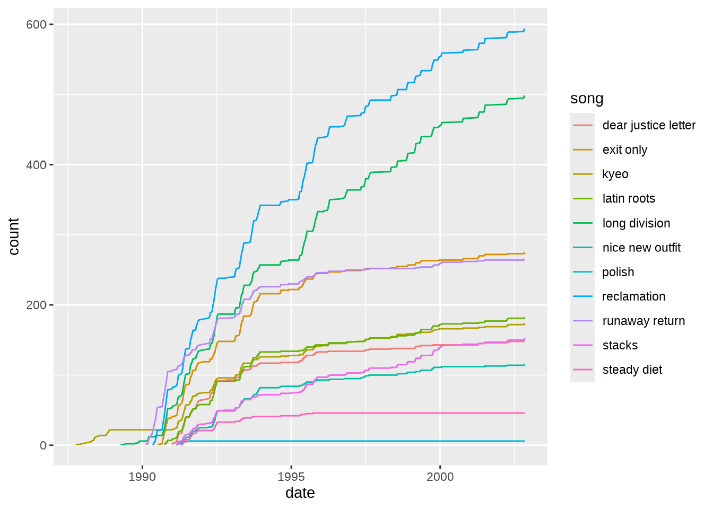

# Link Tracks

## Introduction

A series of brief explorations of the Fugazi Live Series data.

## What was Fugazi’s biggest show?

``` r
attendancedata <- othervariables %>%
  filter(is.na(attendance)==FALSE) %>%
  mutate(attendance = as.integer(attendance)) %>%
  mutate(date = as.Date(date, "%d-%m-%Y")) %>%
  mutate(year = lubridate::year(date)) %>%
  select(year, date, venue, attendance)

maxattendance <- max(attendancedata$attendance)

maxattendance
#> [1] 15000

attendancedata %>%
  filter(attendance == maxattendance)
#> # A tibble: 1 × 4
#>    year date       venue                attendance
#>   <dbl> <date>     <chr>                     <int>
#> 1  2000 2000-06-04 Mission Dolores Park      15000
```

The biggest show was the [Food Not Bombs 20th
Anniversary](https://www.dischord.com/fugazi_live_series/san-francisco-ca-usa-60400)
on the 4th of June 2000 at Mission Dolores Park in San Francisco, with
an estimated attendance of 15000 people. It seems that the show was
recorded but it is not available yet as part of the Fugazi Live Series.
[There is a video of the show on
youtube](https://www.youtube.com/watch?v=0qYvHzS7v-Q).

## What was Fugazi’s longest tour?

``` r

meanattendance <- othervariables %>%
  filter(is.na(tour)==FALSE) %>%
  mutate(attendance = ifelse(is.na(attendance)==TRUE, 100, attendance)) %>%
  group_by(year) %>%
  summarise(meanattendance = mean(attendance)) %>%
  ungroup()

toursdata <- othervariables %>%
  filter(is.na(tour)==FALSE) %>%
  left_join(meanattendance) %>%
  mutate(attendance = ifelse(is.na(attendance)==TRUE,meanattendance,attendance)) %>%
  group_by(tour) %>%
  filter(is.na(date)==FALSE) %>%
  summarise(start = min(date), end = max(date), shows = n(), duration = as.numeric((end - start)), attendance=sum(attendance)) %>%
  ungroup() %>%
  arrange(desc(shows))
#> Joining with `by = join_by(year)`

  toursdata <- toursdata %>%
    mutate(meanattendance = as.integer(attendance / shows)) %>%
    arrange(start)

  toursdata <- toursdata %>%
    mutate(start = as.Date(start, "%d-%m-%Y")) %>%
    mutate(end = as.Date(end, "%d-%m-%Y"))

  toursdata$startyear <- lubridate::year(toursdata$start)
  toursdata$endyear <- lubridate::year(toursdata$end)

  toursdata$duration <- as.integer(toursdata$duration)
  toursdata$attendance <- as.integer(toursdata$attendance)
  
  toursdata <- toursdata %>%
    arrange(desc(shows))

head(toursdata, n=10)
#> # A tibble: 10 × 9
#>    tour           start      end        shows duration attendance meanattendance
#>    <chr>          <date>     <date>     <int>    <int>      <int>          <int>
#>  1 1990 Fall Eur… 1990-09-01 1990-11-07    60       67      43476            724
#>  2 1995 Spring/S… 1995-05-04 1995-07-14    59       71      72134           1222
#>  3 1992 Spring E… 1992-05-01 1992-07-11    56       71      55412            989
#>  4 1995 Fall USA… 1995-09-16 1995-11-20    50       65      68903           1378
#>  5 1993 Spring U… 1993-04-02 1993-05-31    48       59      74550           1553
#>  6 1990 Spring/S… 1990-05-02 1990-06-30    43       59      24080            560
#>  7 1988 Fall Eur… 1988-10-14 1988-12-16    39       63       7376            189
#>  8 1993 Fall USA… 1993-08-16 1993-09-29    39       44      58075           1489
#>  9 1991 Spring U… 1991-05-01 1991-06-14    38       44      27273            717
#> 10 1989 Spring U… 1989-04-05 1989-06-16    35       72      11162            318
#> # ℹ 2 more variables: startyear <dbl>, endyear <dbl>
```

On the 1990 Fall European Tour, between 1990-09-01 and 1990-11-07,
Fugazi played 60 shows over 67 days, with a total attendance of 43,478
people. This tour wasn’t the longest in terms of the number of days, or
the biggest in terms of total attendance (the 1993 Spring USA tour had a
total attendance of 74,550 people), but it was the longest tour in terms
of the number of shows.

## Leads and lags

Most Fugazi songs were performed live for some time before being
released on an album or EP. These lead times were often very
considerable, measured in months or years. Were there any exceptions,
songs whose live launch dates lagged behind the corresponding release
dates? To find out, let’s start by getting the data on the releases and
the corresponding release dates.

``` r
releasedates <- releasesdatalookup %>% 
  select(releaseid, releasedate) %>%
  mutate(releasedate = as.Date(releasedate, "%d/%m/%Y"))

mydf <- songvarslookup %>% 
  left_join(releasedates) %>%
  left_join(songidlookup)
#> Joining with `by = join_by(releaseid)`
#> Joining with `by = join_by(song, songid)`
mydf <- mydf %>% 
  select(songid, song, releaseid, releasedate) %>%
  arrange(songid)
head(mydf)
#>   songid         song releaseid releasedate
#> 1      1 23 beats off         6  1993-06-18
#> 2      2 and the same         2  1989-06-15
#> 3      3     argument         9  2001-10-16
#> 4      4  arpeggiator         8  1998-04-24
#> 5      5 back to base         7  1995-05-12
#> 6      6    bad mouth         1  1988-11-19
```

Now let’s calculate leads and lags by getting summary data on the songs
and comparing the song launch dates to the corresponding release dates.

``` r
mysummary <- Repeatr::summary %>% 
  left_join(mydf) %>%
  mutate(lead = releasedate - launchdate) %>%
  select(song, launchdate, releasedate, lead) %>%
  arrange(lead)
#> Joining with `by = join_by(songid, song, releaseid, releasedate)`

head(mysummary, n = 10)
#> # A tibble: 10 × 4
#>    song                   launchdate releasedate lead    
#>    <chr>                  <date>     <date>      <drtn>  
#>  1 styrofoam              1990-05-17 1990-03-01  -77 days
#>  2 foreman's dog          1998-05-01 1998-04-24   -7 days
#>  3 blueprint              1989-11-25 1990-03-01   96 days
#>  4 steady diet            1991-04-12 1991-08-01  111 days
#>  5 life and limb          2001-06-21 2001-10-16  117 days
#>  6 public witness program 1993-02-05 1993-06-18  133 days
#>  7 polish                 1991-03-06 1991-08-01  148 days
#>  8 bulldog front          1988-06-15 1988-11-19  157 days
#>  9 nice new outfit        1991-02-20 1991-08-01  162 days
#> 10 combination lock       1994-11-27 1995-05-12  166 days
```

Surprisingly, there seem to be only 2 songs whose live debuts lagged
behind the corresponding release dates: Styrofoam which was first played
live 58 days after the launch of Repeater, and Foreman’s Dog which was
first played live 4 days after the launch of End Hits. What was the
average lead time for all Fugazi songs with a corresponding release?

``` r
mean(mysummary$lead)
#> Time difference of NA days
```

That is over 2 years, but perhaps the mean is biased upwards by a few
extreme values…

``` r
mysummary <- mysummary %>%
  select(song, launchdate, releasedate, lead) %>%
  arrange(desc(lead))

head(mysummary, n = 10)
#> # A tibble: 10 × 4
#>    song                 launchdate releasedate lead     
#>    <chr>                <date>     <date>      <drtn>   
#>  1 the word             1987-09-03 2014-11-18  9938 days
#>  2 turn off your guns   1987-09-03 2014-11-18  9938 days
#>  3 in defense of humans 1987-09-03 2014-11-18  9938 days
#>  4 furniture            1987-09-03 2001-10-16  5157 days
#>  5 kyeo                 1987-10-07 1991-08-01  1394 days
#>  6 number 5             1998-11-21 2001-10-16  1060 days
#>  7 oh                   1998-11-29 2001-10-16  1052 days
#>  8 merchandise          1987-09-03 1990-03-01   910 days
#>  9 long division        1989-04-09 1991-08-01   844 days
#> 10 song #1              1987-09-03 1989-12-01   820 days
```

The median lead time is probably a more reliable indicator for how long
Fugazi would tend to play a song live before it featuring on a
discographical release.

``` r
median(mysummary$lead)
#> Time difference of NA days
```

We have discovered several interesting things:

1.  Styrofoam was the only Fugazi song whose live debut significantly
    lagged behind the corresponding release, although the live debut of
    Foreman’s Dog was 4 days after the release of End Hits.

2.  The median lead time for the live performance of a Fugazi song ahead
    of its corresponding discographical release date was approximately 1
    year: 360 days.

## At which venues did Fugazi play the most?

Listening to the Fugazi Live series in chronological order, the band
returns to some venues again and again over the years. Let’s have a look
at the venues with the largest numbers of Fugazi shows.

``` r
venuesdata <- othervariables %>%
  mutate(year = year(date)) %>%
  mutate(city = ifelse(flsid=="FLS1053", "Bremen", city)) %>%
  mutate(country = ifelse(flsid=="FLS1053", "Germany", country)) %>%
  filter(is.na(venue)==FALSE & is.na(city)==FALSE & is.na(country)==FALSE) %>%
  group_by(venue, city, country) %>%
  summarize(shows = n(), from=min(year), to = max(year)) %>%
  select(venue, city, country, shows, from, to) %>%
  arrange(desc(shows)) %>%
  ungroup()
#> `summarise()` has grouped output by 'venue', 'city'. You can override using the
#> `.groups` argument.

head(venuesdata, n = 10)
#> # A tibble: 10 × 6
#>    venue                 city        country shows  from    to
#>    <chr>                 <chr>       <chr>   <int> <dbl> <dbl>
#>  1 Fort Reno             Washington  USA        12  1988  2002
#>  2 Liberty Lunch         Austin      USA         9  1988  1998
#>  3 40 Watt               Athens      USA         8  1988  1999
#>  4 9:30 Club (1980-1995) Washington  USA         8  1988  1994
#>  5 First Avenue          Minneapolis USA         8  1991  2001
#>  6 Maxwell's             Hoboken     USA         8  1988  1998
#>  7 Wilson Center         Washington  USA         8  1987  1997
#>  8 Masquerade            Atlanta     USA         7  1990  1999
#>  9 Cat's Cradle          Chapel Hill USA         6  1987  1993
#> 10 Hollywood Palladium   Los Angeles USA         6  1991  1993
```

The top 10 venues are all in the USA, with the top two both in
Washington DC - Fort Reno and the 9:30 club are the only 2 venues with
more than 10 shows. In the case of Fort Reno, Fugazi played shows there
12 times between 1988 and 2002, only missing 3 years (1990, 1992 and
1995).

Let’s have a look at the top 10 overseas venues.

``` r
overseas_venuesdata <- venuesdata %>%
  filter(country!="USA" & shows>=4) %>%
  arrange(desc(shows))

head(overseas_venuesdata, n = 20)
#> # A tibble: 10 × 6
#>    venue            city                country     shows  from    to
#>    <chr>            <chr>               <chr>       <int> <dbl> <dbl>
#>  1 Forte Prenestino Rome                Italy           5  1988  1999
#>  2 Paradiso         Amsterdam           Netherlands     5  1990  1999
#>  3 92 Graus         Curitiba            Brazil          4  1994  1997
#>  4 Effenaar         Eindhoven           Netherlands     4  1988  1995
#>  5 Fabrik           Hamburg             Germany         4  1990  1999
#>  6 Powerstation     Auckland            New Zealand     4  1991  1997
#>  7 Riverside        Newcastle-Upon-Tyne England         4  1989  1999
#>  8 Rote Fabrik      Zurich              Switzerland     4  1990  1999
#>  9 Schlachthof      Bremen              Germany         4  1990  1999
#> 10 Vera             Groningen           Netherlands     4  1989  1995
```

Overseas, the venues with most Fugazi shows were Forte Prenestino in
Italy and Paradiso in the Netherlands both with 5 shows. There were 9
other overseas venues with 4 shows. Proud to see that the number 1
Fugazi venue in the UK was the Newcastle Riverside, in my home town,
which was where I saw them play in 1990!

Let’s have a quick look at the frequency distribution of the number of
shows at each venue.

``` r
number_venues <- nrow(venuesdata)

cat(paste0("\n \n There are ", number_venues, " venues in the Fugazi Live Series data. \n \n"))
#> 
#>  
#>  There are 753 venues in the Fugazi Live Series data. 
#> 

overview_venuesdata <- venuesdata %>%
  group_by(shows) %>%
  summarize(venues = n()) %>%
  mutate(percentage = round(100*venues/number_venues, digits = 3)) %>%
  arrange(desc(shows)) %>%
  ungroup()

head(overview_venuesdata, n = 11)
#> # A tibble: 10 × 3
#>    shows venues percentage
#>    <int>  <int>      <dbl>
#>  1    12      1      0.133
#>  2     9      1      0.133
#>  3     8      5      0.664
#>  4     7      1      0.133
#>  5     6      3      0.398
#>  6     5      5      0.664
#>  7     4     16      2.12 
#>  8     3     27      3.59 
#>  9     2     97     12.9  
#> 10     1    597     79.3
```

Fugazi played at 733 venues but played at 79.4% of them only once, twice
at 12.7% of venues, 3 shows at 3.4% of venues, and 4 shows at 2.3% of
venues. Only 2.2% of venues had 5 or more shows.

## In which city did Fugazi play at the most venues?

``` r
mydf <- othervariables

venues <- mydf %>% 
  group_by(city, venue) %>% 
  summarize(shows = n()) %>% 
  ungroup()
#> `summarise()` has grouped output by 'city'. You can override using the
#> `.groups` argument.

venues_per_city <- venues %>% 
  group_by(city) %>% 
  summarize(venues = n()) %>% 
  arrange(desc(venues)) %>% 
  ungroup()

venues_per_city
#> # A tibble: 406 × 2
#>    city          venues
#>    <chr>          <int>
#>  1 Washington        21
#>  2 New York          10
#>  3 Sydney             8
#>  4 Chicago            7
#>  5 Houston            7
#>  6 Berlin             6
#>  7 London             6
#>  8 Richmond           6
#>  9 San Francisco      6
#> 10 Birmingham         5
#> # ℹ 396 more rows
```

The city where Fugazi played at the most venues was Washington DC,
followed by New York, and Portland.

## Did Fugazi pick songs to perform randomly?

If songs were picked at random from all available songs, the performance
count for each song should build up in a similar way over time. This can
be checked by plotting the cumulative performance counts for a selection
of songs. First, let’s get the data into a suitable format, so that it
will be easy to count the number of times each song was played.

``` r

mydf <- Repeatr1 %>% select(date, song)

mydf <- mydf %>% 
  group_by(date, song) %>% 
  summarize(count=n()) %>% ungroup()
#> `summarise()` has grouped output by 'date'. You can override using the
#> `.groups` argument.

mydf_wide <- mydf %>% 
  pivot_wider(names_from = song, values_from = count, values_fill = 0)

head(mydf_wide)
#> # A tibble: 6 × 134
#>   date       furniture `in defense of humans` intro `joe #1` merchandise
#>   <date>         <int>                  <int> <int>    <int>       <int>
#> 1 1987-09-03         1                      1     1        1           1
#> 2 1987-09-26         1                      1     1        0           1
#> 3 1987-10-07         1                      1     0        1           1
#> 4 1987-10-16         1                      0     0        1           1
#> 5 1987-11-25         1                      0     1        1           1
#> 6 1987-12-03         1                      1     1        0           1
#> # ℹ 128 more variables: `song #1` <int>, `the word` <int>,
#> #   `turn off your guns` <int>, `waiting room` <int>, `and the same` <int>,
#> #   `interlude 1` <int>, `interlude 2` <int>, `interlude 3` <int>,
#> #   `interlude 4` <int>, outro <int>, `interlude 5` <int>, `interlude 6` <int>,
#> #   kyeo <int>, `bad mouth` <int>, `break-in` <int>, `opening remarks` <int>,
#> #   encore <int>, lockdown <int>, suggestion <int>, `lock dug` <int>,
#> #   `interlude 7` <int>, burning <int>, `give me the cure` <int>, …
```

Next, let’s transform the variable for each song into a cumulative count
of the number of times the song was played.

``` r

mydf_wide2 <- mydf_wide

for(colindex in 2:94) {
  
  mydf_wide2[,colindex] <- cumsum(mydf_wide2[,colindex])     
  
}

head(mydf_wide2)
#> # A tibble: 6 × 134
#>   date       furniture `in defense of humans` intro `joe #1` merchandise
#>   <date>         <int>                  <int> <int>    <int>       <int>
#> 1 1987-09-03         1                      1     1        1           1
#> 2 1987-09-26         2                      2     2        1           2
#> 3 1987-10-07         3                      3     2        2           3
#> 4 1987-10-16         4                      3     2        3           4
#> 5 1987-11-25         5                      3     3        4           5
#> 6 1987-12-03         6                      4     4        4           6
#> # ℹ 128 more variables: `song #1` <int>, `the word` <int>,
#> #   `turn off your guns` <int>, `waiting room` <int>, `and the same` <int>,
#> #   `interlude 1` <int>, `interlude 2` <int>, `interlude 3` <int>,
#> #   `interlude 4` <int>, outro <int>, `interlude 5` <int>, `interlude 6` <int>,
#> #   kyeo <int>, `bad mouth` <int>, `break-in` <int>, `opening remarks` <int>,
#> #   encore <int>, lockdown <int>, suggestion <int>, `lock dug` <int>,
#> #   `interlude 7` <int>, burning <int>, `give me the cure` <int>, …
```

Now, we can reformat the data again to make it a long list of song
counts that show how the number of times each song was performed built
up over time.

``` r

mydf_long <- mydf_wide2 %>%
  pivot_longer(!date, names_to = "song", values_to = "count") %>%
  filter(count>0)

head(mydf_long)
#> # A tibble: 6 × 3
#>   date       song                 count
#>   <date>     <chr>                <int>
#> 1 1987-09-03 furniture                1
#> 2 1987-09-03 in defense of humans     1
#> 3 1987-09-03 intro                    1
#> 4 1987-09-03 joe #1                   1
#> 5 1987-09-03 merchandise              1
#> 6 1987-09-03 song #1                  1
```

Now we are in a position to graph the data so see how the performance
counts evolved over time.

Here is a selection of interesting songs to look at. It would be too
cluttered to plot all the songs at once!

``` r

mydf_long %>%
  filter(song=="furniture" | song=="waiting room" | song=="shut the door" | song=="kyeo" | song=="polish" | song=="steady diet" | song=="smallpox champion" | song=="birthday pony" | song=="break" | song=="nightshop") %>%
  ggplot(aes(date, count, color = song)) +
  geom_line()
```


Another approach is to group the songs by release.

``` r
releases_lookup <- Repeatr1 %>%
  group_by(song, release) %>%
  summarize(count = n()) %>%
  ungroup() %>%
  select(song, release)
#> `summarise()` has grouped output by 'song'. You can override using the
#> `.groups` argument.

mydf_long <- mydf_long %>%
  left_join(releases_lookup)
#> Joining with `by = join_by(song)`

mydf_long %>%
  filter(release=="steady diet of nothing") %>%
  ggplot(aes(date, count, color = song)) +
  geom_line()
```



``` r

cumulative_song_counts <- mydf_long %>%
  select(date, song, release, count)
```

Returning to the initial question of whether Fugazi picked songs
randomly, the short answer is no, it doesn’t look like it. Their choices
indicate preferences that became clearer over time, as can be seen in
the above graphs. They sometimes stopped playing certain songs for
prolonged periods of time. For instance, there were lengthy periods
where KYEO and Furniture were not being played at all, and then they
were brought back and played again. Other songs such as Polish were
dropped and did not return. Some of the decisions of what songs to play
were probably spontaneous but spontaneity is not necessarily the same as
randomness, although there might be some randomness involved. Fugazi
tried [a different system for picking
songs](https://www.dischord.com/fugazi_live_series/waukesha-wi-usa-61590)
once but it only lasted about one song!

There is an interactive version of the above graph available
[here](https://alexmitrani.shinyapps.io/Repeatr-app/) - have fun!

## Mapping the Fugazi Live Series

I have tried my best to locate all the shows on an interactive, online
map. I started with the information on the [Fugazi Live
Series](https://www.dischord.com/fugazi_live_series) website, including
any flyers and comments. Google Maps would find some places quickly but
others would be more difficult - many of the venues are no longer there.
The search was broadened using sites like
[setlist.fm](https://www.setlist.fm/), which sometimes have addresses
for old venues, reading online publications, and reaching out to people
who might remember where the venues were located.

To the best of my knowledge, all of the shows have been located to a
reasonable degree of accuracy. The results can be found
[here](https://alexmitrani.shinyapps.io/Repeatr-app/).

If you see an error that needs correcting, please open an issue on the
[Repeatr GitHub](https://github.com/alexmitrani/Repeatr).

## Sound Quality

Here is a summary of the sound quality ratings of shows in the Fugazi
Live Series. A few of the shows are on
[archive.org](https://archive.org/details/Fugazi) but not on the main
site at this time. The Fort Reno shows include recordings for every
level on the scale from Poor to Excellent.

``` r
sound_quality_ratings <- shows_data %>% 
  filter(is.na(sound_quality)==FALSE) %>% 
  group_by(sound_quality) %>% 
  summarize(shows = n()) %>% 
  ungroup()

totalshows <- sum(sound_quality_ratings$shows)

totalrow <- as.data.frame(t(c("Total", totalshows)))

names(totalrow) <- c("sound_quality", "shows")

sound_quality_ratings <- as.data.frame(rbind(sound_quality_ratings, totalrow))

sound_quality_ratings <- sound_quality_ratings %>%
  mutate(shows = as.numeric(shows)) %>%
  mutate(index = case_when(
    sound_quality == "Excellent" ~ 1,
    sound_quality == "Very Good" ~ 2,
    sound_quality == "Good" ~ 3,
    sound_quality == "Poor" ~ 4,
    sound_quality == "Total" ~ 5
  )) %>%
  arrange(index) %>%
  relocate(index)

sound_quality_ratings <- sound_quality_ratings %>%
  mutate(percentage = round(100*(shows / totalshows),1))

sound_quality_ratings
#>   index sound_quality shows percentage
#> 1     1     Excellent    47        5.2
#> 2     2     Very Good   443       49.4
#> 3     3          Good   344       38.4
#> 4     4          Poor    63        7.0
#> 5     5         Total   897      100.0
```

## Three Repeats, but Only One Two for Tuesdays

There is a small number of shows where the same song was performed
twice, for different reasons. Some are easier to find than others and
there are a few false positives. Let’s have a look, shall we?

``` r
two_for_tuesdays <- Repeatr1 %>% 
  filter(tracktype==1) %>% 
  group_by(date, gid, song) %>% 
  summarize(count = n()) %>% 
  ungroup() %>% 
  filter(count>=2)
#> `summarise()` has grouped output by 'date', 'gid'. You can override using the
#> `.groups` argument.

two_for_tuesdays
#> # A tibble: 6 × 4
#>   date       gid                       song                 count
#>   <date>     <chr>                     <chr>                <int>
#> 1 1988-02-06 annapolis-md-usa-20688    break-in                 2
#> 2 1993-11-17 canberra-australia-111793 reclamation              2
#> 3 1995-10-09 peoria-il-usa-100995      bed for the scraping     2
#> 4 1998-05-11 richmond-va-usa-51198     great cop                2
#> 5 1998-07-31 washington-dc-usa-73198   closed captioned         2
#> 6 1998-07-31 washington-dc-usa-73198   foreman's dog            2
```

‘Break In’ was played twice [in Annapolis in
1988](https://www.dischord.com/fugazi_live_series/annapolis-md-usa-20688)
for musical reasons - Ian broke a string the first time through. Neither
‘Reclamation’ nor ‘Bed for the Scraping’ are true duplicates - in both
cases the song was so badly interrupted the interruption was treated as
a separate track splitting the song in two MP3 tracks. ‘Great Cop’ was
actually played twice due to a conflict with security staff at [the 1998
gig in Richmond,
Virginia](https://www.dischord.com/fugazi_live_series/richmond-va-usa-51198).
The 1998 Sanctuary Theater show in Washington DC features two versions
of both ‘Closed Captioned’ and ‘Foreman’s Dog’ but this is because two
songs from the soundcheck are included in the MP3 download as a bonus.

The real “Two for Tuesdays” was at [a 1991 gig in Birmingham,
Alabama](https://www.dischord.com/fugazi_live_series/birmingham-al-usa-52191),
where the show notes comment “Featuring the one-time attempt of our ‘Two
for Tuesday’ gag. No one appeared to notice, so we shelved the idea.” On
that occasion, the song “Greed” was played twice, and the gag was
announced immediately after the double performance: “Two for Tuesday,
Two for Tuesday”. Perhaps this was a little too subtle? ‘Greed’ is such
a short song you can fit two renditions into the time it would take to
play a normal song. I was specifically looking for the shows where the
same song was played twice and this one didn’t come up on the above list
because ‘Greed’ followed by ‘Greed’ was treated as one song in the track
listing and one MP3 track - perhaps because the person who mastered the
recording didn’t notice either, or perhaps they wanted the gag to live
on in the digital realm? I also missed it the first time I listened to
the show. I bet more people would have noticed if it had been
‘Suggestion’!

Thanks.
