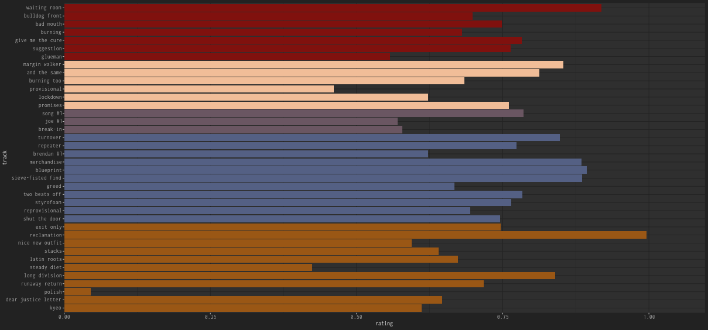
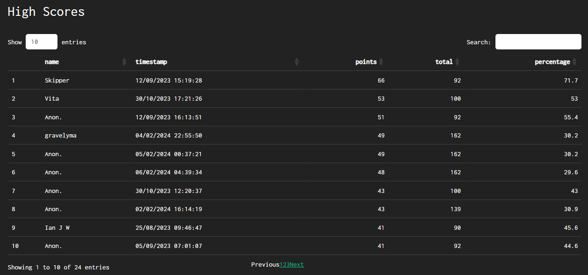

```{r, include = FALSE}
knitr::opts_chunk$set(
  collapse = TRUE,
  fig.width=7,
  fig.height=5,
  comment = "#>"
)
```

```{r, include = FALSE}
library(Repeatr)
```

By Alex Mitrani

11 February 2024

## Introduction

On Sunday the 24 of October 2021 I spoke with Ian James Wright for the 'Steady Diet' episode of the Alphabetical Fugazi podcast, and Ian kindly shared with me his Fugazi Live Series data. I found the Fugazi Live Series data fascinating and I already knew I liked the music as I had been a Fugazi fan for over 30 years, so before long I had bought myself an 'All Access' subscription.

Between the 15 of November 2021 and the 4 of February 2024 I listened to all the shows that were available on the Fugazi Live Series site and whatever additional shows I could find. I listened to 915 Fugazi shows in 812 days - I tried to limit myself to 1 show a day but there were a few days when I listened to more than one. I went through the series in chronological order from FLS0001 (1987-09-03) to FLS1045 (2002-11-04) and then did a search for [additional shows not yet available on the Fugazi Live Series site](https://alexmitrani.github.io/Repeatr/articles/Outsiders.html) and listened to those as well. The show I ended on was FLS0177 (1990-01-27), St. Augustine's Church Hall, the first show of 1990 and a fitting conclusion to what had been an interesting and enjoyable journey.

## Ratings

My first use of the data was to estimate implied song ratings based on the bands' choices of which songs to perform. This was the beginning of what would become the [Fugazetteer](https://alexmitrani.shinyapps.io/Fugazetteer/) web app. It was also one of my first experiences of Fugazi's tendency to defy expectations. One of my assumptions was that the band would play each song only once on any given night. I soon heard back that there were several exceptions to this, and found that [Fugazi played a song twice on at least three occasions](https://alexmitrani.github.io/Repeatr/articles/LinkTracks.html#three-repeats-but-only-one-two-for-tuesdays).

[](https://alexmitrani.shinyapps.io/Fugazetteer/)

## Map

I got into the habit of listening to a show in the morning while I was getting up and doing exercises, this way I could fit in one show a day without it affecting my other activities too much. Listening to the shows in chronological order produced a pleasant feeling of travelling, and I enjoyed imagining and finding out about the different places the tours would take the band, as well as the different bands that would accompany Fugazi.

My curiosity kept leading me to other ways of using the Fugazi Live Series data, some of which involved adding new variables to the data. I added the coordinates of the venues because I wanted a map that would help me to visualize where each show was and where the tour was going to next. Locating the venues was easier said than done in some cases as many venues no longer exist so I had to look through flyers, old fanzines, and ask people who had been to the shows. People I reached out to on social media or by e-mail almost invariably replied and were friendly and helpful. This small project of locating the venues of the Fugazi Live Series is probably the closest I ever got to doing historical research.

[](http://subkultur-ost.de/Howl%2002-89%20%28Muenchen%29%20Fanzine%20%6089OCRkl.pdf)

Locating the venues took time but I got quite a lot of use out of the resulting maps, because Fugazi would go to far-flung places and would make tours that would not fit neatly on maps. For instance, they played Tromso in Norway in 1990 (350 km north of the Arctic Circle); Anchorage, Alaska in 1995; Darwin, Australia in 1997; and when they went to Brazil they did a proper tour visiting some smaller places as well as several of the big cities. I found that being able to follow each tour on a map made listening to the Fugazi Live Series more interesting and enjoyable. Sometimes the maps would also help understand the band's on-stage banter, which would sometimes refer to the drive they just made to get to the show, the ferry that they had missed, or the trip they had made in their time off.

[](https://alexmitrani.shinyapps.io/Fugazetteer/)

## Playlists

As I made my way through the series I took note of the shows I would probably want to come back to and listen to again in future. The result was a playlist of 246 shows which can be found [here](https://alexmitrani.github.io/Repeatr/articles/Playlist.html). This is not an exhaustive list of good shows, these are just the shows that stood out to me. I was trying to be selective so if there was a run of shows that all sounded good I would try to just pick a few and not all of them. The sound quality and the availability of recordings both tend to improve as the series progresses, so there are relatively fewer shows from the early part of the series, for most of the middle part of the series I was picking approximately 1 in 5 shows, and towards the end of the series I was picking more because most of the shows sounded really good. Overall 246 from 915 is about 27% - a bit more than 1 in 4.

Some of the shows on the playlist are not there because they sound great, some of them are there because they are interesting or unusual for other reasons. For instance there is [FLS0203, 2301 Canton Warehouse, Dallas, TX, USA, 1990-05-04](https://www.dischord.com/fugazi_live_series/dallas-tx-usa-50490) where a fire warden wanted to shut down the show and the band ended up playing to an empty warehouse with the audience outside in the street. Ian MacKaye tells the story much better than me [@mackaye2013]. [FLS0396, Silver Dollar, Phoenix, AZ, USA, 1991-09-09]([https://www.dischord.com/fugazi_live_series/phoenix-az-usa-90991)](https://www.dischord.com/fugazi_live_series/phoenix-az-usa-90991)) was so eventful it seems almost cinematic. Another one that comes to mind is [FLS0731, Expo Gardens, Peoria, IL, USA, 1995-10-09]([https://www.dischord.com/fugazi_live_series/peoria-il-usa-100995)](https://www.dischord.com/fugazi_live_series/peoria-il-usa-100995)) where the band comes up with a creative solution to deal with a few anti-social but extremely persistent crowd surfers. Then there is [FLS0761, Showcase Special Events, San Antonio, TX, USA, 1995-11-18]([https://www.dischord.com/fugazi_live_series/san-antonio-tx-usa-111895)](https://www.dischord.com/fugazi_live_series/san-antonio-tx-usa-111895)) which probably has the record for the highest number of expulsions.

Later on I made another, much shorter list which I call the 'miniseries' - 9 shows that include at least one rendition of all 94 songs that were played at least twice in the Fugazi Live Series, including all the rare ones:

[FLS0073, Kapu, Linz, Austria 1988-10-11](https://www.dischord.com/fugazi_live_series/linz-austria-111088)

[FLS0149, Barnard College Cafeteria, New York, NY, USA, 1989-10-09](https://www.dischord.com/fugazi_live_series/new-york-ny-usa-100989)

[FLS0327, Sacred Heart Church Hall, Washington, DC, USA, 1991-04-12](https://www.dischord.com/fugazi_live_series/washington-dc-usa-41291)

[FLS0505, 40 Watt, Athens, GA, USA, 1993-02-19](https://www.dischord.com/fugazi_live_series/athens-ga-usa-21993)

[FLS0664, Metropolitan University, Leeds, England, 1995-05-15](https://www.dischord.com/fugazi_live_series/leeds-england-51595)

[FLS0764, Black Cat, Washington, DC, USA, 1996-01-30](https://www.dischord.com/fugazi_live_series/washington-dc-usa-13096)

[FLS0870, Maxwell's, Hoboken, NJ, USA, 1998-07-27](https://www.dischord.com/fugazi_live_series/hoboken-nj-usa-72798)

[FLS0998, Sacred Heart Church, Washington, DC, USA, 2001-04-27](https://dischord.com/fugazi_live_series/washington-dc-usa-42701)

[FLS1041, Metropolitan University, Leeds, UK, 2002-10-31](https://dischord.com/fugazi_live_series/leeds-england-103102)

Nearly all (8 of the 9) shows on the short list are on the long list as well, so I feel confident in recommending the miniseries to those who might want a short, reasonably representative sample of the Fugazi Live Series.

## Fugazetteer

Fugazetteer is a web app based on the Fugazi Live Series data, it aims to make it easier to answer questions about the series and to find interesting shows to listen to. If you enjoy listening to shows from the Fugazi Live Series you might find it interesting and useful. It includes maps, graphs, information on the durations of shows and renditions, and a variety of different ways of searching for shows. Where appropriate, Fugazetteer provides links back to the corresponding show pages on the Fugazi Live Series site. You can find the Fugazetteer app [here](https://alexmitrani.shinyapps.io/Fugazetteer/) and the documentation [here](https://alexmitrani.github.io/Repeatr/articles/Fugazetteer.html).

## Quiz

I wrote a quiz about the Fugazi Live Series as a way of making use of the considerable amount of trivia knowledge I accumulated while making my way through the live series. There are 76 questions worth a total of 162 points. You can find it [here](https://forms.gle/cxWd38nPi6Dtk9ub8). It's a proper hard quiz, it'll be a good challenge for you. There is a high scores table included in the Fugazetteer app, you'll be included in the high scores table if your score places you in the top half.



Do it.

Now.

## Practicalities

An All Access pass allows you to download all the shows from the Fugazi Live Series website via a 'Fugazi Live Series' button that appears at the top of your 'My Account' page. You need to download the shows one by one. I used to download shows about once a week, at the weekend I'd download the shows for the next week or so.

I ended up spending a few minutes editing the metadata and filenames of each show to make sure that each MP3 file had a unique filename and it would be easy to find any show based on the date. I renamed each album starting with the date in format YYYYMMDD and each file with the date and the 2-digit track number (with leading zero if necessary) so the files end up named like YYYYMMDDTT and can be sorted in chronological order. This makes shows easy to find by just typing in the date of the show, and specific renditions of songs can be found by typing in the date and track number.

The Fugazi Live Series takes up about 160 GB of disk space - that is including embedded images for album art. It fits on a pendrive. I wanted to be able to listen to any show in the series from my phone via Wi-Fi and the way I found to do this was to buy cloud storage and to use a mobile app that allows playing or downloading music from cloud storage. At the time of writing there are some providers offering lifetime deals on cloud storage, I got one of those because that way the cost of the cloud storage seemed proportional and is never going to be more than the price I paid for the Fugazi Live Series All Access pass.

## Conclusion

I really enjoyed listening to the Fugazi Live Series, it includes a lot of great music, lively banter, and was in general an interesting experience. I learned a lot in the process, for instance I learned to appreciate live music and live music recordings a lot more than I did before. I took notes of the shows that stood out to me as I went through the series and ended up with [a list of 246 shows](https://alexmitrani.github.io/Repeatr/articles/Playlist.html), which was me trying to be selective. An All Access Pass is definitely worth considering if you can afford it and like Fugazi's music.

There's an anecdote about painting the Forth Bridge (near Edinburgh, Scotland) which is that by the time they finished painting the bridge they would have to start painting it again at the other end. An All Access pass to the Fugazi Live Series is a lifetime supply of Fugazi shows because even if you listen to all the shows, by the time you reach the end you will have forgotten the shows at the beginning. So I could just start at the beginning again. But not now. Give me a break.

## References
