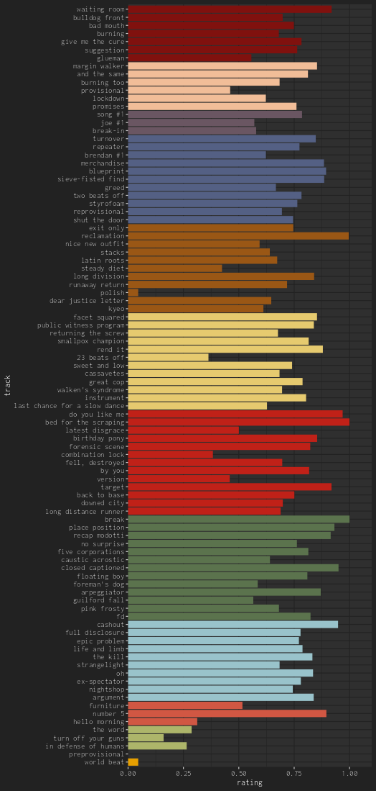
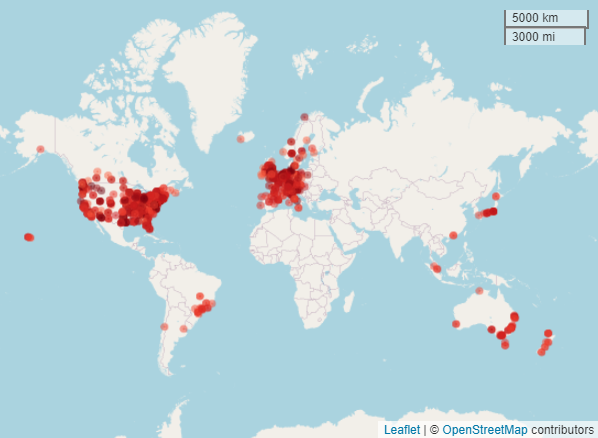

```{r, include = FALSE}
knitr::opts_chunk$set(
  collapse = TRUE,
  fig.width=7,
  fig.height=5,
  comment = "#>"
)
```

```{r, include = FALSE}
library(Repeatr)
```

By Alex Mitrani

11 February 2024

On Sunday the 24 of October 2021 I spoke with Ian James Wright for the 'Steady Diet' episode of the Alphabetical Fugazi podcast, and Ian kindly shared with me his Fugazi Live Series data. My first use of the data was to estimate implied song ratings based on the bands' choices of which songs to perform. This was the beginning of what would become the [Fugazetteer](https://alexmitrani.shinyapps.io/Fugazetteer/) web app.

[](https://alexmitrani.shinyapps.io/Fugazetteer/)

I found the Fugazi Live Series data fascinating and I already knew I liked the music as I had been a Fugazi fan for over 30 years, so before long I had bought myself an 'All Access' subscription.

Between the 15 of November 2021 and the 4 of February 2024 I listened to all the shows that were available on the Fugazi Live Series site and whatever additional shows I could find. I listened to 915 Fugazi shows in 812 days - I tried to limit myself to 1 show a day but there were a few days when I listened to more than one. I went through the series in chronological order from FLS0001 (1987-09-03) to FLS1045 (2002-11-04) and then did a search for [additional shows not yet available on the Fugazi Live Series site](https://alexmitrani.github.io/Repeatr/articles/Outsiders.html) and listened to those as well. The show I ended on was FLS0177 (1990-01-27), St. Augustine's Church Hall, the first show of 1990 and a fitting conclusion to what had been an interesting and enjoyable journey.

I got into the habit of listening to a show in the morning while I was getting up and doing exercises, this way I could fit in one show a day without it affecting my other activities too much. Listening to the shows in chronological order produced a pleasant feeling of travelling, and I enjoyed imagining and finding out about the different places the tours would take the band, as well as the different bands that would accompany Fugazi. My curiosity kept leading me to other ways of using the Fugazi Live Series data, some of which involved adding new variables to the data. For instance, I added the coordinates of the venues because I wanted a map that would help me to visualize where each show was and where the tour was going to next. Fugazi seemed to make a habit of going to places many other bands would not go, for instance they played Tromso in Norway in 1990 (350 km north of the Arctic Circle), Anchorage, Alaska in 1995, Darwin, Australia in 1997, and when they went to Brazil they did a proper tour visiting some smaller places as well as several of the big cities.

[](https://alexmitrani.shinyapps.io/Fugazetteer/)
