```{r, include = FALSE}
knitr::opts_chunk$set(
  collapse = TRUE,
  fig.width=7,
  fig.height=5,
  comment = "#>"
)
```

```{r, include = FALSE}
library(Repeatr)
```

## introduction

The [Repeatr-app](https://alexmitrani.shinyapps.io/Repeatr-app/) makes it easy to get some insights and answer questions about the Fugazi Live Series. It also provides several new ways of finding shows to listen to. The app has 7 pages which will be described in the following sections. Each page shows a visualisation (map or graph) and a data table, with the exception of 'search' which only has a data table.

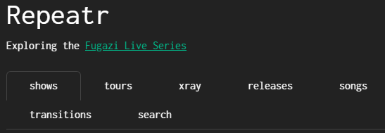

Most of the input boxes are 'selectize' controls - when you select the control a menu will appear, and if you start typing the menu will be filtered by what you type. You can select any number of items or none at all.

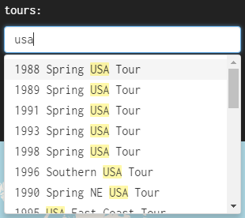

A few of the input boxes are menus where you can only select one option - these have a little down arrow to the right side of the input box.

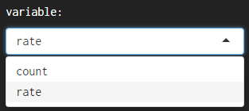

The data for songs is limited to songs that were played live at least twice in the Fugazi Live Series. That is 92 songs which feature in the Fugazi discography and one unreleased song - 'Preprovisional'.

The release dates are best estimates based on the available evidence. Actual release dates will have varied depending on the location.

The show locations have been determined as closely as possible using the available evidence. The search started with the information on the Fugazi Live Series website, including any flyers and comments. Google Maps would find some places quickly but others would be more difficult - many of the venues are no longer there. The search was broadened using sites like setlist.fm, which sometimes had addresses for old venues, reading online publications, and reaching out to people who might remember where the venues were located.

[](http://subkultur-ost.de/Howl%2002-89%20%28Muenchen%29%20Fanzine%20%6089OCRkl.pdf)

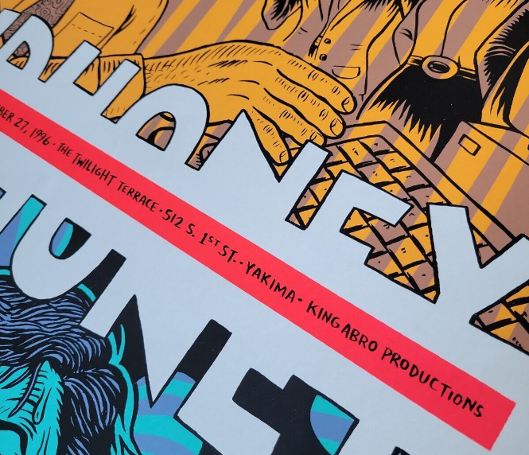

There may still be "false positives" - cases where an address was found but the address might be wrong. Please let me know if you find anything that needs correcting.

## shows

The map shows the locations of the Fugazi shows and the table below the map has some details of each show and a link to the corresponding page on the [Fugazi Live Series](https://www.dischord.com/fugazi_live_series) site.

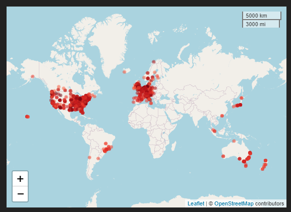

The marker colours go from dark red to light red in chronological order, with the most recent shows having the lightest colour.


The data can be filtered by typing in the selection boxes for years, tours, countries and cities.

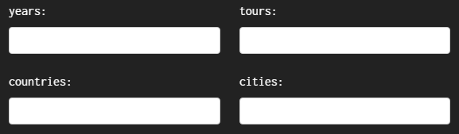

When a box is blank it means there is no filter applied to the data for that variable. The selections apply sequentially from left to right and from top to bottom. For instance, if you select a year the remaining menus will be filtered to show only data for the selected year.

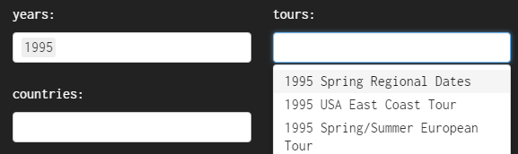

The map has zoom controls and by clicking and dragging you can pan the map view. The area of the red circle for each show is proportional to the attendance of the show. If you click on the red circle for a show a pop-up will appear with the date, the venue, the city and the attendance.

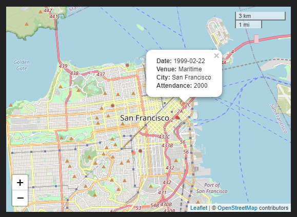

The timeline slider below the map allows filtering the data by date. The position of the slider control corresponds to the oldest date of the selection, so if you move the slider forward from left to right you will progressively filter out older shows.

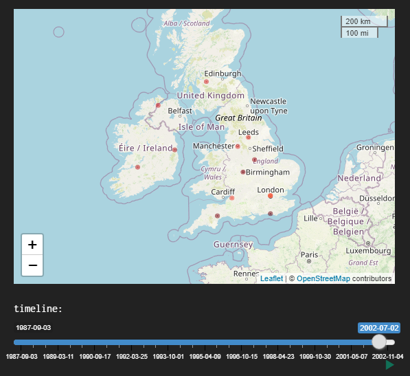

There are some specific controls for use with the timeline slider:

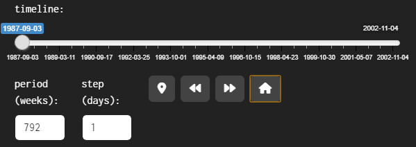

-   period (weeks) indicates the duration of the selected period in weeks. It is initially set to 792 weeks which covers the full duration of the Fugazi Live Series.

-   step (days) indicates the size of each step in days, this is for use with the fast forward and reverse buttons.

-   the 'map marker' button will change the period to 1 week and the step to 1 day, starting at the date selected with the timeline slider. It will also change the start and end dates of the timeline slider to match the start and end dates of the tour. You can then step forward through the tour one day at a time, or use the 'play' button to the bottom-right of the timeline to animate the tour.

    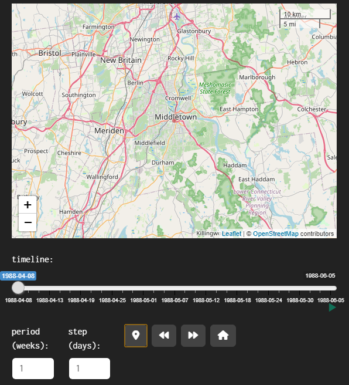

-   'fast-forward' will move the selection forward in time by one step

    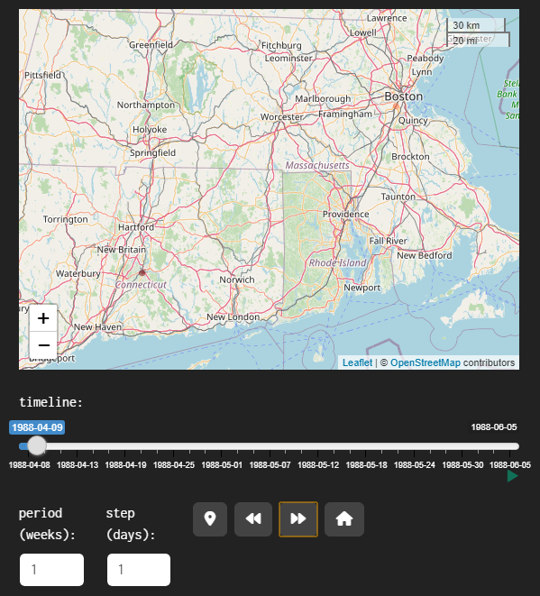

-   'rewind' will move the selection back in time by one step

    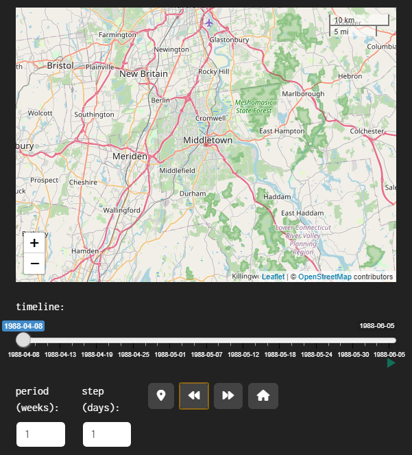

-   'home' will move the timeline slider back to the beginning and set the period to 792 weeks again, to select the entire series. It is recommended to use the home button before changing the selections in the selection boxes above the map.

    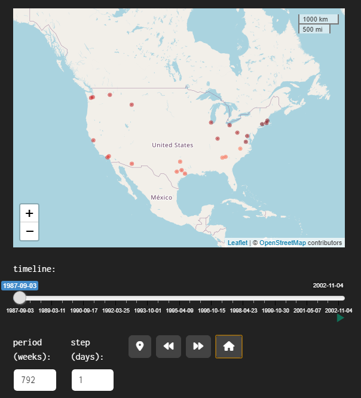

The data table below the map and the timeline controls shows summary data for the selected shows.

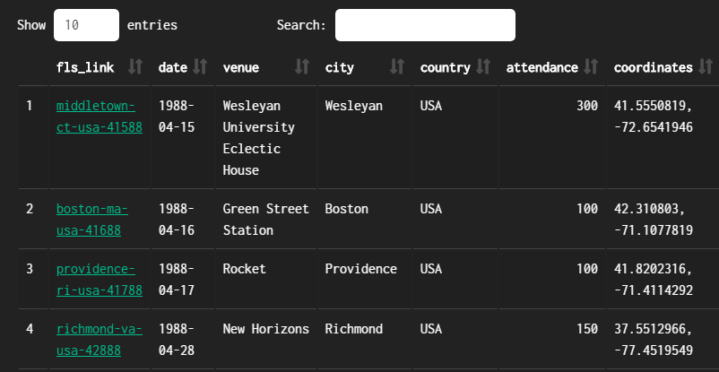

Each of the following columns can be sorted using the sort controls to the right of the variable name:

-   fls_link - a link to the corresponding page of the [Fugazi Live Series](https://www.dischord.com/fugazi_live_series) site

-   date

-   venue

-   city

-   country

-   attendance

-   coordinates - if you copy the coordinates you can display the location of a show in an online map of your choice.

## tours

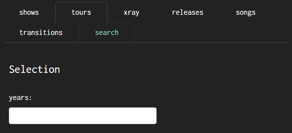

The 'years' selection box can be used to filter the data to show only specific years.

The graph on the tours page shows the cumulative attendance across the shows in the Fugazi Live Series.

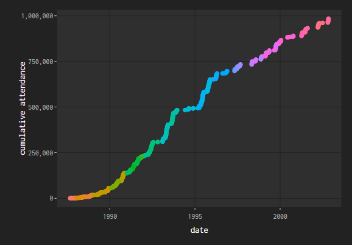

The colours identify specific tours. The graph is interactive - if you hover over a point it will display details of the date, the cumulative attendance and the tour.

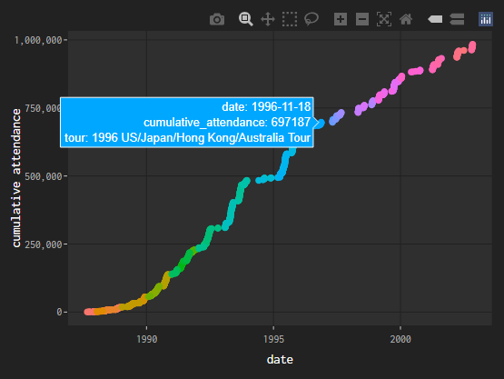

The data table shows summary data for the tours.

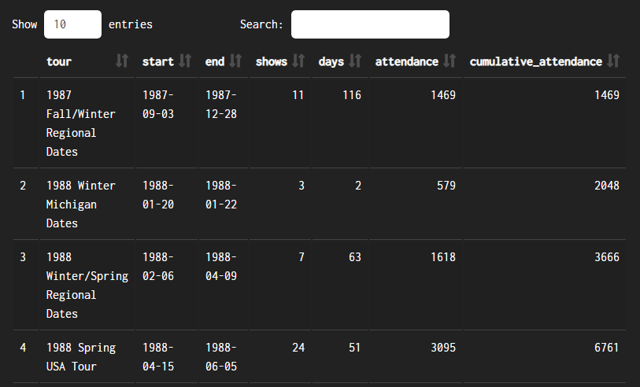

Each of the following columns can be sorted using the sort controls to the right of the variable name:

-   tour

-   start - start date of the tour

-   end - end date of the tour

-   shows - number of shows

-   days - duration of the tour in days

-   attendance - total attendance for the tour

-   cumulative_attendance - comulative attendance since the start of the Fugazi Live Series.

## xray

The stacked bar graph on this page shows the composition of each show in terms of the releases on which the songs feature, or whether the songs were released or not at the time of the show.

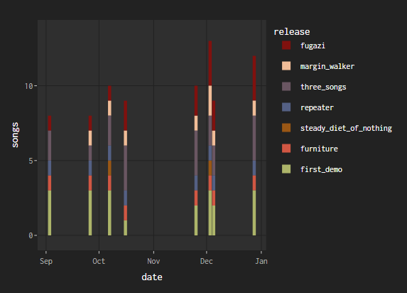

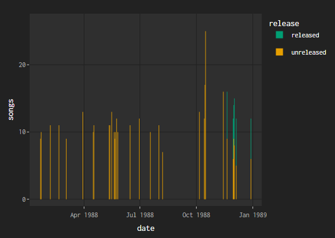

The data can be filtered by:

-   years

-   tours

The filters are applied sequentially from left to right.

The 'variable' control offers two options:

-   releases - show how many songs were drawn from each release

-   unreleased - show how many songs were unreleased at the time

The data table below the graph provides summary data for each show:

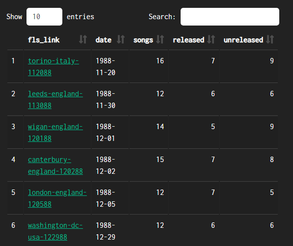

-   fls_link - a link to the corresponding page of the [Fugazi Live Series](https://www.dischord.com/fugazi_live_series) site

-   date - the date of the show

-   songs - the total number of songs

The remaining columns will vary depending on whether the option selected for 'variable' is 'releases' or 'unreleased'. All columns can be sorted, which makes it easy to find the shows with the most songs, the most unreleased songs, or the shows with the most songs from a particular release.

## releases

The bar chart shows summary data for each song of each Fugazi release, sorted in ascending order of release date and track number from top to bottom.

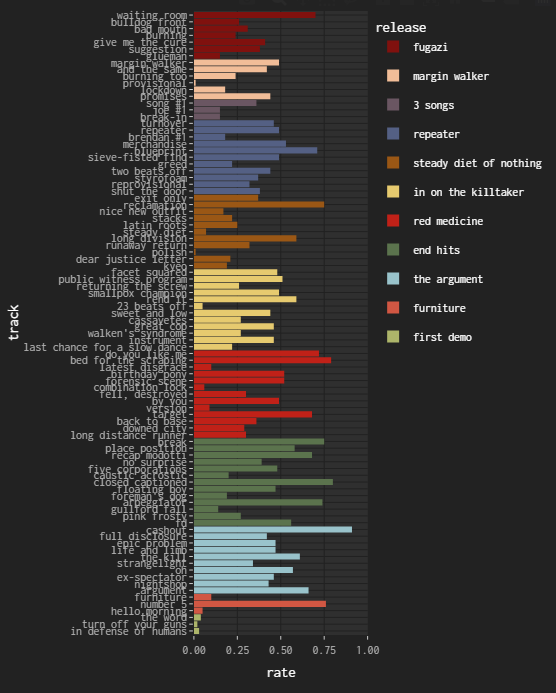

The data can be filtered for one or more specific releases using the 'release' selection box.

The 'variable' menu has two options:

-   count - the number of times the song was performed in the Fugazi Live Series. All else being equal, older songs tend to have higher counts because they were available in the band's repertoire for more shows.

-   rate - the number of times the song was performed divided by the number of shows since the song's debut. This variable normalizes the counts by the potential maximum number of performances to give fairer treatment to newer songs.

The data table includes the following columns, all of which can be sorted:

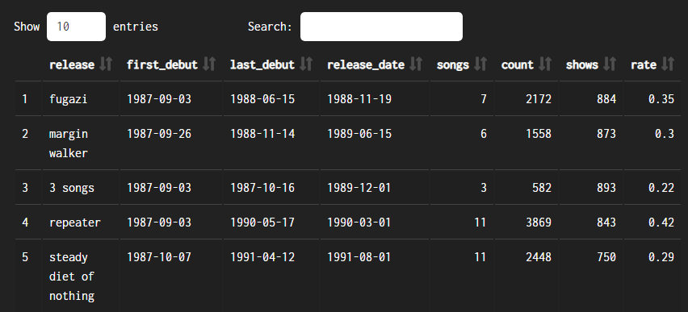

-   release

-   first_debut - the date of the first debut from this release

-   last_debut - the date of the last debut from this release

-   release_date - this is an assumption based on the available evidence. Actual release dates will have been different in different places.

-   songs - number of songs on the release

-   count - total number of performances of the songs on the release

-   shows - number of shows at which songs from the release were performed

-   rate - the average of the rates for the songs on the release

The counts and the rates give different results if they are used to rank the releases. Repeater was the album that yielded more live performances than any other in Fugazi's catalogue, but The Argument had the highest performance rate in relation to the number of shows at which these songs were available.

## songs

The graph shows the cumulative performance counts for each song.

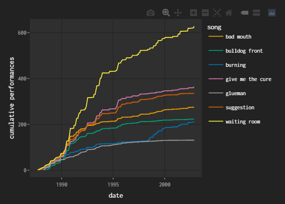

The data can be filtered by the following variables:

-   years

-   tours

-   release

-   songs

These filters are applied sequentially from left to right and from top to bottom.

The graph shows a lot of detail on how each song fared across the live series, including 'flatline' periods where songs were not played at all, and periods of steep growth where songs were played night after night for significant periods.

The data table offers the following columns:

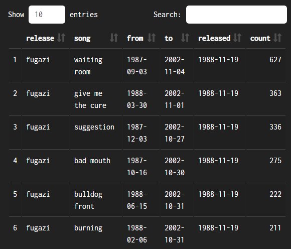

-   release

-   song

-   from - first time performed (within the selected time period)

-   to - last time performed (within the selected time period)

-   released - corresponding release date

-   count - number of times performed (within the selected time period)

The dates and performance counts correspond to the selected data, so these values will change whenever you change the filters for years or tours.

## transitions

The heatmap shows the number of times each transition was performed. The graph is interactive - if you hover over a point, a pop-up will appear showing 'to' (song), 'from' (song) and 'count' - the number of times the transition was performed.

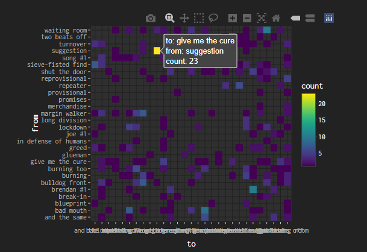

The data can be filtered by:

-   years

-   tours

These filters are applied sequentially from left to right. For instance, if you select 1995 for 'years', the 'tours' menu will only show the 1995 tours.

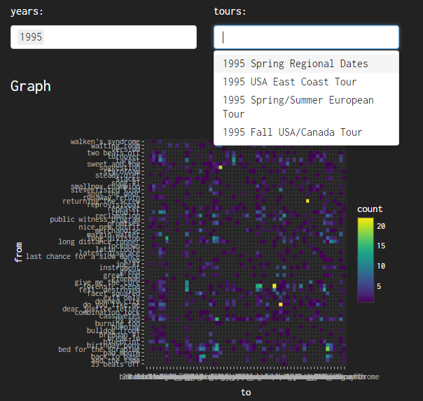

The data table includes:

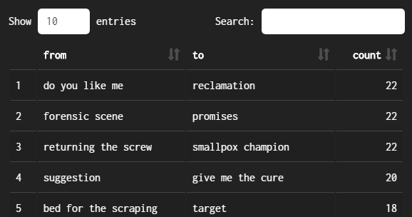

-   from - the first song in the transition

-   to - the second song in the transition

-   count - the number of times the transition was performed (within the selected time period)

## search

Here you can find shows that contain specific songs or specific transitions between songs.

There are two filters:

-   from - the first song in the transition

-   to - the second song in the transition

The filters are applied sequentially from left to right, so for instance if you specify 'life and limb' in 'from', the menu for 'to' will only show songs which followed 'life and limb'.

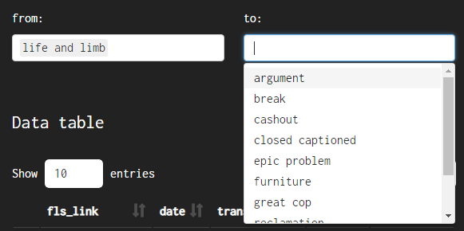

Both filters are optional. If only one song is specified shows containing that song will be listed. If no song is specified all the shows will be listed. There is a subtle difference between searching for shows containing a single song using the 'from' box and the 'to' box: the 'from' box will omit shows where the song was the final one of the set, and the 'to' box will omit shows where the song was the first one of the set. This is why searching for 'glueman' with 'from' yields only 25 shows but searching for 'glueman' with 'to' yields 131 results - 'glueman' was a hard song to follow!

The data table includes:

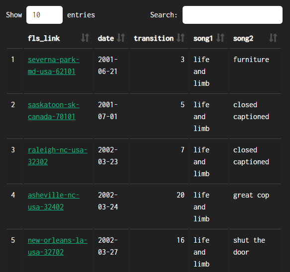

-   fls_link provides a link to the corresponding page of the [Fugazi Live Series](https://www.dischord.com/fugazi_live_series) site

-   date - date of the show

-   transition - this is the number of the transition in the set, where 1 is the first transition in that show. Larger numbers will indicate that the transition was played later in the set.

-   song1 - the first song in the transition

-   song2 - the second song in the transition

Thanks.
