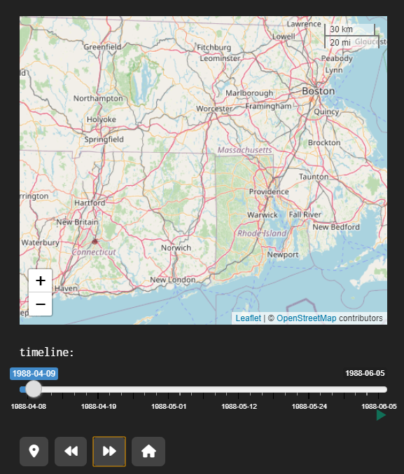
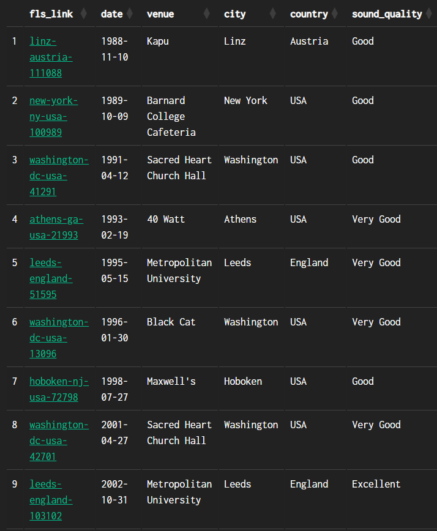
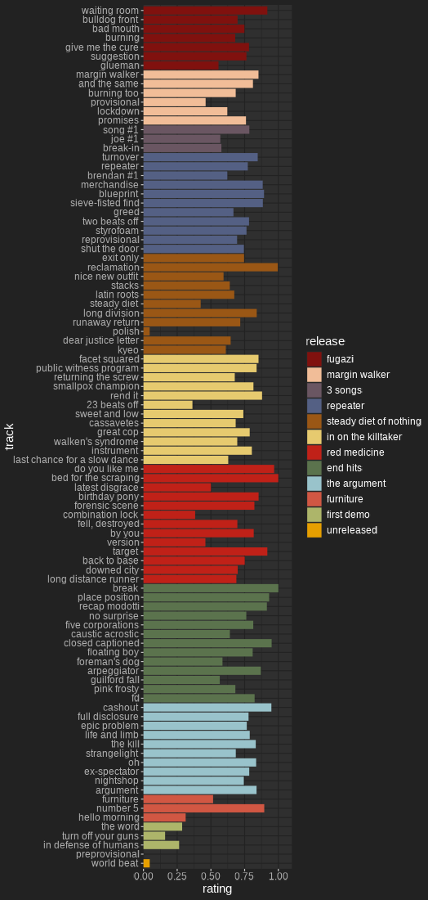

```{r, include = FALSE}
knitr::opts_chunk$set(
  collapse = TRUE,
  fig.width=7,
  fig.height=5,
  comment = "#>"
)
```

```{r, include = FALSE}
library(Repeatr)
```

# introduction

The [Repeatr-app](https://alexmitrani.shinyapps.io/Repeatr-app/) makes it easy to get some insights and answer questions about the Fugazi Live Series. It also provides several new ways of finding shows to listen to.


The app has 13 pages spread across 3 sections:

-   flow (9 pages) - includes top-level menus for 'year' and 'tour' which will filter the contents of all the pages in this section.

    

-   stock (4 pages) - includes a top-level menu for 'release' which will filter the contents of all the pages in this section.

    

-   quiz (1 page) - links to Fugazi Live Series Quiz #1 and shows the high scores to date.

    

Most of the pages have a visualisation (map or graph) and a data table further down the page, with the exception of 'transition', 'duration' and 'search' which only have data tables.

Most of the input boxes are 'selectize' controls - when you select the control a menu will appear, and if you start typing the menu will be filtered by what you type. You can select any number of items or none at all.


A few of the input boxes are menus where you can only select one option - these have a little down arrow to the right side of the input box.


The data for songs is limited to songs that were played live at least twice in the Fugazi Live Series. That is 92 songs which feature in the Fugazi discography and one unreleased song - 'Preprovisional'.

The release dates are best estimates based on the available evidence. Actual release dates will have varied depending on the location.

The show locations have been determined as closely as possible using the available evidence. The search started with the information on the Fugazi Live Series website, including any flyers and comments. Google Maps would find some places quickly but others would be more difficult - many of the venues are no longer there. The search was broadened using sites like setlist.fm, which sometimes had addresses for old venues, reading online publications, and reaching out to people who might remember where the venues were located.

[](http://subkultur-ost.de/Howl%2002-89%20%28Muenchen%29%20Fanzine%20%6089OCRkl.pdf)


There may still be "false positives" - cases where an address was found but the address might be wrong. Please let me know if you find anything that needs correcting.

# flow

> pulse stalls\
> uncut but clotted\
> when you had thought it\
> would force a flow
>
> -   last chance for a slow dance by Fugazi (1993)

This section focuses on the tours and live shows, and most of the pages have a time dimension to them. The top-level menus of 'year' and 'tour' can be left blank but if applied will filter the contents of all the pages in this section. This is useful if you are interested in a specific year or tour. Note that you are not limited to just one year or just one tour, in both cases several can be specified if you wish.

When a box is blank it means there is no filter applied to the data for that variable. The selections apply sequentially from left to right and from top to bottom. For instance, if you select a year the remaining menus will be filtered to show only data for the selected year.


## shows

The map shows the locations of the Fugazi shows and the table below the map has some details of each show and a link to the corresponding page on the [Fugazi Live Series](https://www.dischord.com/fugazi_live_series) site.


The marker colours go from dark red to light red in chronological order, with the most recent shows having the lightest colour.


The data can be filtered by typing in the selection boxes for countries and cities.


The map has zoom controls and by clicking and dragging you can pan the map view. The area of the red circle for each show is proportional to the attendance of the show. If you click on the red circle for a show a pop-up will appear with the date, the venue, the city, the attendance, and the coordinates - in case you should want to look for a place using a different mapping application.


The timeline slider below the map allows filtering the data by date. The position of the slider control corresponds to the oldest date of the selection, so if you move the slider forward from left to right you will progressively filter out older shows.


There are some specific controls for use with the timeline slider.


-   the 'map marker' button will change the period to 1 week and the step to 1 day, starting at the date selected with the timeline slider. It will also change the start and end dates of the timeline slider to match the start and end dates of the tour. You can then step forward through the tour one day at a time, or use the 'play' button to the bottom-right of the timeline to animate the tour.

    

-   'fast-forward' will move the selection forward in time by one step

    

-   'rewind' will move the selection back in time by one step

    

-   'home' will move the timeline slider back to the beginning and set the period to 792 weeks again, to select the entire series. It is recommended to use the home button before changing the selections in the selection boxes above the map.

    

Notice that pressing the 'home' button reveals additional controls:


-   period_weeks indicates the duration of the selected period in weeks. It is initially set to 792 weeks which covers the full duration of the Fugazi Live Series.

-   step_days indicates the size of each step in days, this is for use with the fast forward and reverse buttons.

These controls can be used to customise how the timeline works. For instance, if you set 'period_weeks' to 52 and 'step_days' to 365, then the map will show a year's worth of shows from the date shown on the timeline, and the forward and backward buttons will shift the period shown forward or backward by 1 year. This can be useful if you want to skip through the whole timeline quickly, one year at a time.

Unticking the 'show' checkbox will hide the 'period_weeks' and 'step_days' controls. This makes the interface less cluttered and will be especially useful on mobile devices with small screens.

The data table below the map and the timeline controls shows summary data for the selected shows.


Each of the following columns can be sorted using the sort controls to the right of the variable name:

-   fls_link - a link to the corresponding page of the [Fugazi Live Series](https://www.dischord.com/fugazi_live_series) site

-   date

-   venue

-   city

-   country

-   attendance

-   minutes - duration of the show in minutes if a recording is available.

-   sound_quality - Sound quality rating: Excellent, Very Good, Good, or Poor.

## with

This page offers information on the bands that Fugazi played with, as either a summary and a map:

-   map - show locations with a different colour for each band

-   summary - shows the number of shows played with each band

### map

The map will show the show locations, using a different colour for each band.


The data table accompanying the map shows details for each show and a link that can be used to navigate to the corresponding page of the Fugazi Live Series site.


### summary

The summary option shows a bar chart and a simple data table. The information will be limited to the top 20 bands if no bands are specified. If you specify one or more bands, the bar chart and the table will show the data for these bands.


The summary data table will detail the number of shows with each band in descending order.


## attendance

The contents of this page will vary depending on the filters specified.

### filtered

If one or more years or tours are selected, the graph will show the attendance of each show in the selected period.


The data table will show information for the specific shows in the selected period.


Each of the following columns can be sorted using the sort controls to the right of the variable name:

-   tour

-   date

-   fls_link - a link to the corresponding page of the [Fugazi Live Series](https://www.dischord.com/fugazi_live_series) site

-   attendance - attendance of the show (some of these are rough estimates when no data provided on the FLS site)

-   sound_quality

### unfiltered

If no years or tours are selected, the graph will show the cumulative attendance for the whole [Fugazi Live Series](https://www.dischord.com/fugazi_live_series).


The colours identify specific tours. The graph is interactive - if you hover over a point it will display details of the date, the cumulative attendance and the tour.


The data table will show summary data for the tours when no years or tours are specified.


Each of the following columns can be sorted using the sort controls to the right of the variable name:

-   tour

-   start - start date of the tour

-   end - end date of the tour

-   shows - number of shows

-   days - duration of the tour in days

-   attendance - total attendance for the tour

-   cumulative_attendance - comulative attendance since the start of the Fugazi Live Series.

## xray

This page offers a stacked bar chart designed to show the composition of each show in a variety of ways.

The 'graph' menu offers three options:

-   releases - show how many songs were drawn from each release. This option includes only songs.

-   unreleased - show how many songs were unreleased at the time. This option includes only songs.

-   other - show how much of each show is songs and how much is other stuff (intros, interludes, encores, one-offs and outros). This option includes all the tracks of each show.

The 'units' menu offers two options:

-   tracks - y-axis of the graph in units of tracks

-   minutes - y-axis of the graph in units of minutes


The data table below the graph provides summary data for each show:


-   fls_link - a link to the corresponding page of the [Fugazi Live Series](https://www.dischord.com/fugazi_live_series) site

-   date - the date of the show

-   songs - the total number of songs, or number of minutes of songs, depending on the selected units.

The remaining columns will vary depending on whether the option selected for 'variable' is 'releases', 'unreleased', or 'other'. All columns can be sorted, which makes it easy to find the shows with the most songs, the most unreleased songs, the shows with the most songs from a particular release, and so on.

## renditions

Here you can select specific songs and see information on how the number of times they were played varied over time. For instance, here the selected songs were all played a limited number of times, often over a very limited period of time:


The graph shows the cumulative rendition counts for a selection of songs that were played in the specified period. To avoid the graph getting cluttered the songs are sorted in descending order of growth rate over the period, and the song selection is limited to a maximum number of songs. The maximum number of songs to be shown can be varied using the slider control under the graph.


The data can be filtered by the following variables:

-   years

-   tours

These filters are applied sequentially from left to right.

The graph shows a lot of detail on how each song fared across the live series, including 'flatline' periods where songs were not played at all, and periods of steep growth where songs were played night after night for significant periods.

The data table shows summary information for each song over the specified period.


The data table offers the following columns:

-   release

-   song

-   from - first time performed (within the selected time period)

-   to - last time performed (within the selected time period)

-   released - corresponding release date

-   count - number of times performed (within the selected time period)

The dates and performance counts correspond to the selected data, so these values will change whenever you change the filters for years or tours.

The data table can be downloaded to a CSV file using the download button at the top of the page to the right of the 'songs' selection box.

## matrix

The heatmap shows the number of times each transition was performed. The graph is interactive - if you hover over a point, a pop-up will appear showing 'to' (song), 'from' (song) and 'count' - the number of times the transition was performed. The maximum number of transitions to be shown can be varied using the slider control beneath the graph.


The data table shows the number of times each transition featured in the specified period. The transitions are shown in descending order of plays.


The data table includes:

-   from - the first song in the transition

-   to - the second song in the transition

-   count - the number of times the transition was performed (within the selected time period)

## transition

Here you can find shows that contain a specific transition between songs.

There are two filters:

-   from - the first song in the transition

-   to - the second song in the transition

The filters are applied sequentially from left to right, so for instance if you specify 'life and limb' in 'from', the menu for 'to' will only show songs which followed 'life and limb'.

{alt="Sequential filtering on the 'search' page."}

Both filters are optional. If only one song is specified shows containing that song will be listed. If no song is specified all the shows will be listed. There is a subtle difference between searching for shows containing a single song using the 'from' box and the 'to' box: the 'from' box will omit shows where the song was the final one of the set, and the 'to' box will omit shows where the song was the first one of the set. This is why searching for 'glueman' with 'from' yields only 25 shows but searching for 'glueman' with 'to' yields 131 results - 'glueman' was a hard song to follow!


The data table includes:

-   fls_link provides a link to the corresponding page of the [Fugazi Live Series](https://www.dischord.com/fugazi_live_series) site

-   date - date of the show

-   transition - this is the number of the transition in the set, where 1 is the first transition in that show. Larger numbers will indicate that the transition was played later in the set.

-   song1 - the first song in the transition

-   song2 - the second song in the transition

## sets

Here you can compare two or more shows to find out which songs are played in each, how many unique songs there are, and how many songs are played only once or in 2 or more of the shows. You can pick shows from the full series or you can filter first by year and/or tour to pick shows from a shorter list. For example, we can compare the three Swedish shows from the 2000 North European tour.


Note that the show identifiers are the same as those used on the Fugazi Live Series website and have the following format: city-country-(m)m-dd-yy. The month will be one or two digits depending on which month it is.

Once shows have been selected, two results tables will appear. The first is a summary table.


The summary table tells us that 52 unique songs were played: 32 songs were played only once, 12 songs were played twice, and 8 songs were played at all 3 shows. The three shows have 80 songs in total, including the repeated performances.

The Details table shows the complete list of songs, and for each song which show or shows it was performed at. The table is sorted in descending order of the number of shows each song was performed at, so in this case the top part of the table lists the 8 songs that were performed at all 3 shows.


The 'details' table can be downloaded as a CSV file using the download button at the top of the page to the right of the 'shows' selection box. .

## stacks

Here you can choose any starting show (out of the 899 shows with setlists available to date) and will get a short sequence of 9-12 shows including the starting show and covering all 94 songs that Fugazi played live at least twice.


Once a show has been selected, two results tables will appear. The first is a summary table, including links to the shows.



The second table provides details of the shows in which each song was played.


The summary table can be downloaded to a CSV file using the download button at the top of the page to the right of the 'show' selection box.

# stock

> Laws of stimulation /\
> Signed anonymous\
> It's just a stock set-up
>
> -   Foreman's dog by Fugazi (1998)

## discography

The bar chart shows summary data for each song of each Fugazi release, sorted in ascending order of release date and track number from top to bottom.



The legend can be turned on or off - you may prefer to have it off if you are using a device with a small screen.


The 'variable' menu has three options:

-   count - the number of times the song was performed in the Fugazi Live Series. All else being equal, older songs tend to have higher counts because they were available in the band's repertoire for more shows.

-   intensity - the number of times the song was performed divided by the number of shows since the song's debut. This variable normalizes the counts by the potential maximum number of performances to give fairer treatment to newer songs.

-   rating - the rating calculated for the song based on preferences implied by the choices of which songs to play.

The contents of the data table will vary depending on whether or not one or more releases have been specified.

### unfiltered

If no release filter has been applied, the data table will show summary information for each release.


The data table includes the following columns, all of which can be sorted:

-   release

-   first_debut - the date of the first debut from this release

-   last_debut - the date of the last debut from this release

-   release_date - this is an assumption based on the available evidence. Actual release dates will have been different in different places.

-   songs - number of songs on the release

-   count - total number of performances of the songs on the release

-   shows - number of shows at which songs from the release were performed

-   intensity - the average of the intensities of the songs on the release

-   rating - the average of the ratings of the songs on the release

The counts, intensities and ratings give different results if they are used to rank the releases. Repeater was the album that yielded more live performances than any other in Fugazi's catalogue, but The Argument had the highest performance rate in relation to the number of shows at which these songs were available. The top 3 places are the same in terms of rating and intensity, but further down the table there are differences - the Fugazi EP is ranked higher than Red Medicine and In on the Killtaker when the releases are ranked by rating. This is probably because the ratings take into account the age of the releases and separate the effects of age from the implied preferences.

### filtered

If one or more releases are specified using the top-level menu, both the graph and the data table will adapt to focus on the selected releases.


The data table includes the following columns, all of which can be sorted:

-   release

-   track_number

-   song

-   count - total number of performances of each song

-   intensity - the performance intensity of each song (renditions / potential shows)

-   rating - the rating calculated for the song based on preferences implied by the choices of which songs to play.

## variation

This page shows cumulative distributions of song durations and summary data for the renditions of each song. You can filter the contents to be displayed on the graph by release or by song, and in both cases several can be chosen. The graph will show by default a maximum of 10 songs - this maximum number of songs can be varied using the slider beneath the graph.


The data table below the graph shows summary data for renditions of the selected songs.


The data table includes:

-   renditions - the number of times the song was played

-   minutes_min - the minimum duration. In many cases this will be as short as it is because the recording was cut off, not because the band played the song really fast.

-   minutes_median - the median duration: if all the renditions were lined up in order from shortest to longest this would be the middle one.

-   minutes_max - the maximum duration.

-   minutes_mean - the average duration.

-   minutes_sd - the standard deviation of the duration - this is a measure of spread, it indicates how much variation there is across all of the renditions.

-   minutes_total - the total duration of all the times the song was played.

## duration

On this page you can select a song and get a table listing all the shows containing the specified song and the duration of each specific rendition (in minutes). You can also select more than one song. The table headers can be used to sort the data, so for instance you can find the shows with the longest (or shortest) renditions of a particular song. The search box can be used to filter for a particular show so you can see the durations of all the songs played in that show.


-   fls_link provides a link to the corresponding page of the [Fugazi Live Series](https://www.dischord.com/fugazi_live_series) site

-   date - date of the show

-   song_number- this is the number of the song in the set, where 1 is the first song in that show. Larger numbers will indicate that the song was played later in the set.

-   song - the name of the song

-   duration - the duration of the song in minutes.

## search

This page allows you to search for shows that contain a specific selection of songs. For instance:


The data table lists the shows that contain any of the specified songs (or all the shows if none were specified), including the following columns:

-   fls_link provides a link to the corresponding page of the [Fugazi Live Series](https://www.dischord.com/fugazi_live_series) site

-   date - date of the show

-   hits - the number of the specified songs included in the show (or the number of songs if none were specified)

-   sound_quality - Sound quality rating: Excellent, Very Good, Good, or Poor.

If you filter by release but not songs the data will be limited to all shows containing songs from the specified release. This provides a neat way of finding shows with many songs from your favourite album, for instance if you like 'End Hits' sorting in descending order of hits gives you these results:


# quiz


The top half of the scores will be included in the High Scores table. If you complete the quiz and place in the top half, your entry will be included, although you might need to re-load the page for the content to be refreshed with the latest responses data. The total points shown are the total points that were available at the time that each entry was completed - every now and then this total might change die to new questions being added, old questions being removed, or changes being made to the value of each question. The percentage is the score divided by the total available points in each case, and it is this value that is used to sort the table.

For further information about the quiz, follow the link at the top of the quiz page. If you are ready for a challenge, give it a try!

Thanks.
